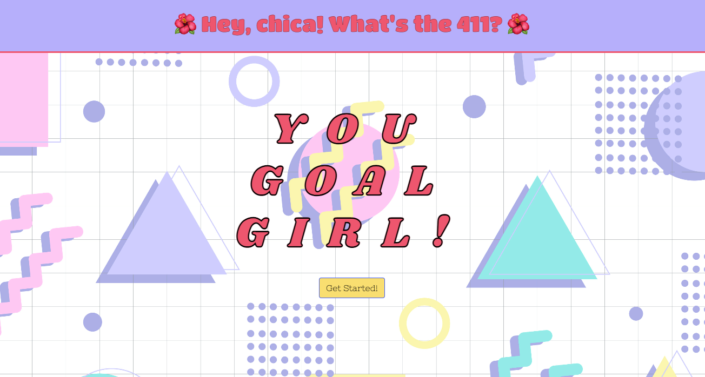
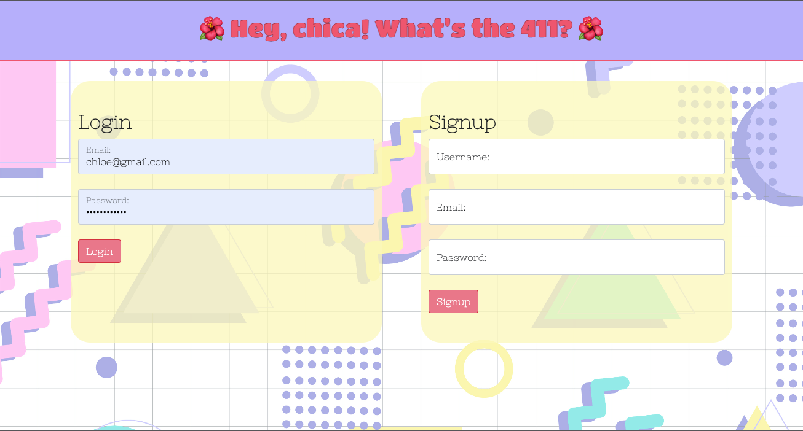
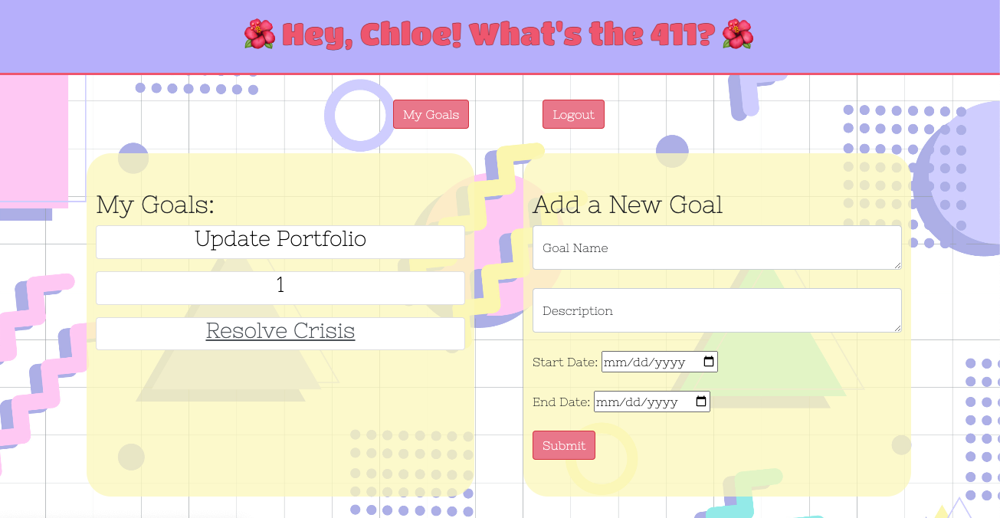
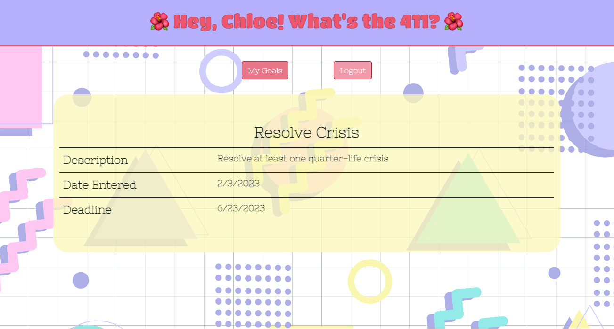

# You Goal Girl!

## Table of Contents
- [Description](#description)
- [Installation](#installation)
- [Technologies Used](#technologies-used)
- [Visual Presentation](#visual-presentation)
- [Credits](#credits)
- [License](#license)
- [Links](#links)

## Description

You Goal Girl hopes to inspire any person to achieve their goals with a 90s-themed website where each user can add and view each goal. 

Here's how it works:

- When a user opens the website, the user is brought to the homepage where the user would then be able to select the "Get Started" button.

- The user then redirects the user to the page to either log in or sign up.

- Once the user is properly logged in OR signs up (automatically logs the new user into the website), the user is redirected to their personal page which lists all the goals they have.

- On the profile page, the user can create however many goals. When a goal is created, the goal title will appear on the profile page in order from newest to oldest. 

- The user can click on any of the goal title to redirect to that goal's specific page, which displays a table with the goal's details.

- The user can choose to return to their goal list page (profile) by selecting the "My Goals" link next to the logout button.

- After logging in, the user can choose to log out at anytime by selecting the "logout" button either from their profile page or from one of their goal pages.

Beyond the creative genius of the three collaborators on this project, the following requirements were met to bring the website to fruition:

* Use Node.js and Express.js to create a RESTful API.

* Use Handlebars.js as the template engine.

* Use MySQL and the Sequelize ORM for the database.

* Have both GET and POST routes for retrieving and adding new data.

* Use at least one new library, package, or technology that we haven’t discussed.

* Have a folder structure that meets the MVC paradigm.

* Include authentication (express-session and cookies).

* Protect API keys and sensitive information with environment variables.

* Be deployed using Heroku (with data).

* Have a polished UI.

* Be responsive.

* Be interactive (i.e., accept and respond to user input).

* Meet good-quality coding standards (file structure, naming conventions, follows best practices for class/id naming conventions, indentation, quality comments, etc.).

* Have a professional README (with unique name, description, technologies used, screenshot, and link to deployed application).

## Installation

From the command line, run:

- npm init -y

- npm i mysql2

- npm i sequelize

- npm i express

- npm i dotenv

- npm i bcrypt

- npm run seed (if desired)

- npm run start

## Technologies Used

* Node.js
* Express.js
* MySQL
* Sequelize
* express-session
* connect-session-sequelize
* Handlebars.js
* dotenv
* bcrypt
* Heroku
* anime.js

## Visual Presentation

Below are screenshots, which show each page of the website

 
 
 
 
 

## Credits

Resources used:
1) Bootcamp Pre-work Modules in 14-MVC
2) Documentation linked in the homework activities
3) stackoverflow
4) [90s images](https://www.freevector.com/vector/90s)

## License

Please refer to the LICENSE in the repository.

## Links 
GitHub Repo: [https://github.com/chloeeh/you-goal-girl](https://github.com/chloeeh/you-goal-girl)

Heroku Link: [Click to view the website!](https://clj-yougoalgirl.herokuapp.com/)

